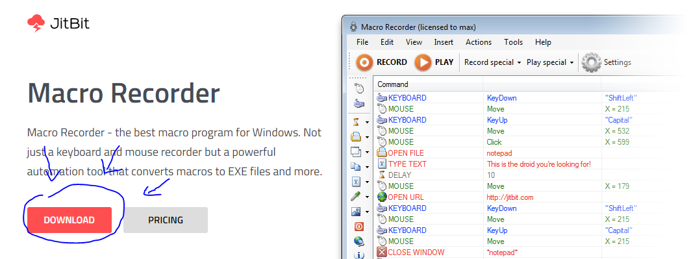
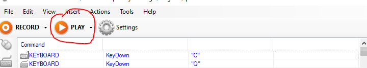
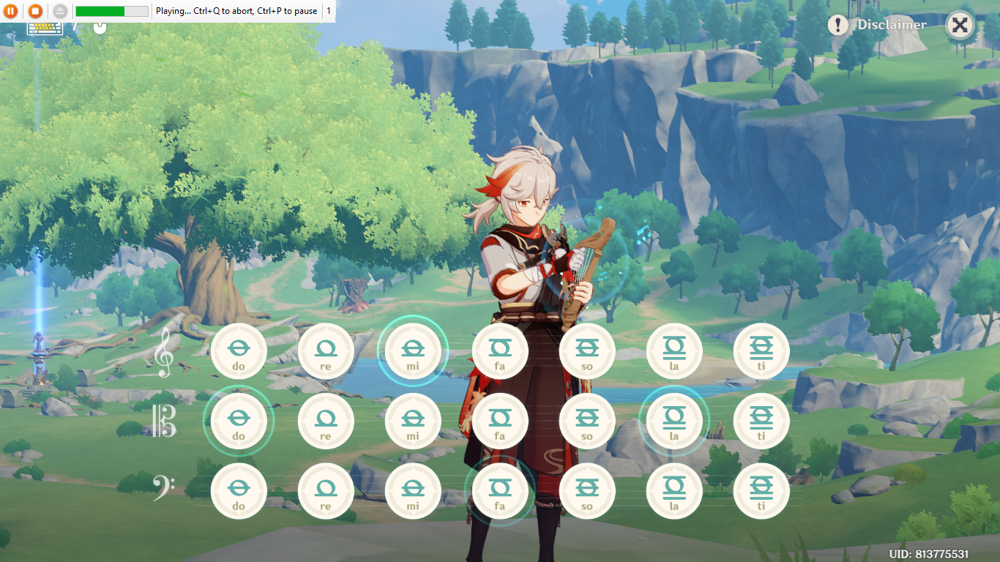

# Genshin-Impact-lyre-songs

collection of lyre songs with macro recording to run a song on Windsong Lyre in genshin impact game

## How to use

1. Download and instal Macro Recorder [link download](https://www.jitbit.com/macro-recorder/)
   
2. open genshin impact game
3. use windsong lyre tool. if you don't have, can be bought at Marjorie's Souvenir Shop in Mondstadt or [Genshin Music Nightly](https://specy.github.io/genshinMusic/#/)
   
4. open Macro Recorder
5. open selected file [song list](https:/)
   
6. click play
   
7. it runs automatically, click pause first (ctrl+P). click play again when in the game genshin impact
   

### **Have Fun** ✨

